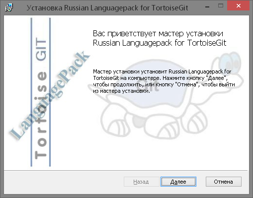
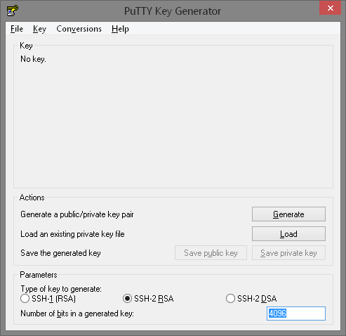
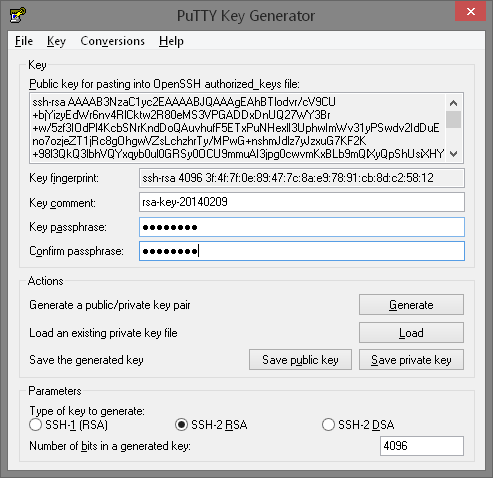

###Лабораторная работа

#Введение в системы контроля версий. Git. Установка и настройка Git.

###Теоретическая часть

####Что такое система управления версиями? 
Система контроля версий позволяет отслеживать историю коллекции файлов и включает в себя функционал для возвращения коллекции файлов другой версии. Каждая версия захватывает снимок файлов в определенный момент времени. Набор файлов, как правило, исходный код на языке программирования, но типичная система контроля версий может работать с любым типом файлов. 

Набор файлов и их полная история хранятся в **репозитории(repository)**.

Снимки могут быть использованы, чтобы изменить свою коллекцию файлов. Можно, например, возвращается в набор файлов в состояние от 2 дней назад. Или вы можете переключаться между версиями для экспериментальных функций.

####Что такое распределенная система контроля версий?
Распределенная система контроля версий, не обязательно имеет центральный сервер, который хранит данные.

Пользователь может скопировать существующий репозиторий. Этот процесс копирования обычно называют **клонирование** в распределенной системе управления версиями и полученное хранилище может упоминаться как клон.

Обычно существует центральный сервер для хранения репозитория, но все клонированные хранилища являются его полной копией. Решение, какой из экземпляров считается центральным хранилищем сервер чисто выборочная и не привязаны к возможностям самой распределенной системы контроля версий.

Каждый клон содержит полную историю коллекции файлов и имеет ту же функциональность, что и оригинальный репозиторий.

Каждый репозиторий может обменять версии файлов с других хранилищах, транспортируя эти изменения. Обычно это делается с помощью хранилища работающего на сервере, который, кроме локальной машине разработчика, всегда он-лайн.

####Что такое Git? 
Git - это распределенная система контроля версий. 

Git появился в результате разработки ядра Linux и используется многими популярными Open Source проектами, например Android, а также многими коммерческими организациями.

Ядро Git было изначально написано на языке программирования C, но Git также вновь реализован и на других языках, например, Java, Ruby и Python.

#####Положительные стороны
- Высокая производительность.
- Развитые средства интеграции с другими VCS.
- Репозитории git могут распространяться и обновляться
общесистемными файловыми утилитами, такими как rsync.

#####Негативные стороны
- Отсутствие переносимой на другие операционные системы
поддержки путей в кодировке Unicode.
- Команды ориентированны на наборы изменений, а не на файлы.
- Использование для идентификации ревизий хешей SHA1.
- Отсутствие отдельной команды переименования/переноса
файла, которая так отображалась бы в истории.

####Локальный репозиторий и операции 
После клонирования или создания хранилища пользователь имеет полную копию в хранилище. Пользователь выполняет операции управления версиями в своем локальном репозитории, например создает новые версии, отменяет изменения и т.д. 

Вы можете настроить хранилище быть пустими или не-пустыми. 

- пустые хранилища используются на серверах для обмена изменений, поступающих от разных разработчиков.
- не-пустые хранилища позволяют создавать новые изменения посредством модификации файлов и создавать новые версии в репозитории.

Если вы хотите удалить репозиторий Git, вы можете просто удалить папку, содержащую хранилище.

####Сетевые репозитории 
Git позволяет пользователю синхронизировать локальный репозиторий с удаленными(remote) репозиториями. 

Пользователи с соответствующими правами доступа могут подтолкнуть(push) изменения от их локального репозитория в удаленнй репозиторий. Они также могут принести или тянуть изменения от других хранилищ в их локальный репозиторий Git.

####Почти все операции — локальные
Для совершения большинства операций в Git'е необходимы только локальные файлы и ресурсы, т.е. обычно информация с других компьютеров в сети не нужна. Если вы пользовались централизованными системами, где практически на каждую операцию накладывается сетевая задержка, вы, возможно, подумаете, что боги наделили Git неземной силой. Поскольку вся история проекта хранится локально у вас на диске, большинство операций кажутся практически мгновенными.

####Git следит за целостностью данных
Перед сохранением любого файла Git вычисляет контрольную сумму, и она становится индексом этого файла. Поэтому невозможно изменить содержимое файла или каталога так, чтобы Git не узнал об этом. Эта функциональность встроена в сам фундамент Git'а и является важной составляющей его философии. Если информация потеряется при передаче или повредится на диске, Git всегда это выявит.

####Чаще всего данные в Git только добавляются
Практически все действия, которые вы совершаете в Git'е, только добавляют данные в базу. Очень сложно заставить систему удалить данные или сделать что-то неотменяемое. Можно, как и в любой другой СКВ, потерять данные, которые вы ещё не сохранили, но как только они зафиксированы, их очень сложно потерять, особенно если вы регулярно отправляете изменения в другой репозиторий.

####Три состояния
>Теперь внимание. Это самое важное, что нужно помнить про Git, если вы хотите, чтобы дальше изучение шло гладко.

В Git'е файлы могут находиться в одном из трёх состояний: зафиксированном, изменённом и подготовленном. "Зафиксированный" значит, что файл уже сохранён в вашей локальной базе. К изменённым относятся файлы, которые поменялись, но ещё не были зафиксированы. Подготовленные файлы — это изменённые файлы, отмеченные для включения в следующий коммит.

Таким образом, в проектах, использующих Git, есть три части: каталог Git'а (Git directory), рабочий каталог (working directory) и область подготовленных файлов (staging area).

Каталог Git'а — это место, где Git хранит метаданные и базу данных объектов вашего проекта. Это наиболее важная часть Git'а, и именно она копируется, когда вы клонируете репозиторий с другого компьютера.

Рабочий каталог — это извлечённая из базы копия определённой версии проекта. Эти файлы достаются из сжатой базы данных в каталоге Git'а и помещаются на диск для того, чтобы вы их просматривали и редактировали.

Область подготовленных файлов — это обычный файл, обычно хранящийся в каталоге Git'а, который содержит информацию о том, что должно войти в следующий коммит. Иногда его называют индексом (index), но в последнее время становится стандартом называть его областью подготовленных файлов (staging area).

Стандартный рабочий процесс с использованием Git'а выглядит примерно так:

- Вы вносите изменения в файлы в своём рабочем каталоге.
- Подготавливаете файлы, добавляя их слепки в область подготовленных файлов.
- Делаете коммит, который берёт подготовленные файлы из индекса и помещает их в каталог Git'а на постоянное хранение.

Если рабочая версия файла совпадает с версией в каталоге Git'а, файл считается зафиксированным. Если файл изменён, но добавлен в область подготовленных данных, он подготовлен. Если же файл изменился после выгрузки из БД, но не был подготовлен, то он считается изменённым. В главе 2 вы узнаете больше об этих трёх состояниях и как можно либо воспользоваться этим, либо пропустить стадию подготовки.

###Практическая часть

Настало время немного ознакомиться с использованием Git'а. Первое, что вам необходимо сделать, — установить его. Есть несколько способов сделать это, но сейчас мы рассмотрим способ его установки на Windows + интерфейс TortoiseGit для его более удобного использования.

####Установка Git

1. Скачайте установщик Git для Windows: [http://git-scm.com/download/win](http://git-scm.com/download/win). И запустите его.

Версия, показанная на экране может отличаться от изображенного здесь, конечно. То есть устанавливаете версию Git 1.8.5.2 или более поздней версии.
2. Нажмите Далее, чтобы перейти к следующей странице мастера. 
Установка отображает лицензионное соглашение.
3. Нажмите Далее, чтобы принять условия лицензионного соглашения и продолжить. 
Для этой установки желательно использовать все значения настроек по умолчанию:
    - Add “Git Bash here”
    - Run Git from the Windows Command Prompt
    - Use Windows style line endings
4. Чтобы принять все значения по умолчанию, нажмите Далее на каждой странице диалога, который идет после лицензионного соглашения. 
5. Нажмите Готово на последней странице диалога, чтобы завершить установку.
6. Все, установка завершена. Для проверки можно в консоли ввести команду `git` и появление перечня всех основнйх комманд будет значит что все в порядке.

####Установка TortoiseGit

1. Скачайте установщик TortoiseGit для Windows: [https://code.google.com/p/tortoisegit/wiki/Download](https://code.google.com/p/tortoisegit/wiki/Download). И запустите его.

2. Нажмите Далее, чтобы перейти к следующей странице мастера. 
Установка отображает лицензионное соглашение.
3. Нажмите Далее, чтобы принять условия лицензионного соглашения и продолжить. 
Для этой установки желательно использовать все значения настроек по умолчанию:
    - TortoisePlink. TortoisePlink это копия некоторых putty инструментов, которые пнадобятся вам позже (в частности, для создания RSA ключей).

####Создание нового RSA ключа

RSA является асимметричным алгоритмом шифрования используется для проверки подлинности пользователей без использования паролей. Он используется вместо пароля просто потому, что обеспечивает механизм для проверки, кто ты, не давая на другой конец информации о вас.
Для создания такого ключа нам понадобится PuTTYgen. Он устанавливается вместе с TortoiseGit, и вы можете найти его в меню Пуск.

1. Запустите эту утилиту.

2. Изменените `Number of bits in a generated key` в правом нижнем углу, до 4096. Это текущая приемлемая длина RSA ключей.
3. Нажмите `Generate`, для начала генерации.

4. Вы должны будете перемещать курсор мыши ниже, вокруг или над индикатором хода некоторое время.
5. Под конец вы получите экран:

6. Введите пароль для вашего ключа.
7. Затем нажмите `Save private key` и сохраните его в надежном месте.

####Создание первого репозитория и настройка Git'a.

###Контрольные вопросы

1. Что такое система управления версиями? 
2. Что такое распределенная система контроля версий?
3. Что такое Git?
4. В чем разница между пустым и непустым репозиторием?
4. Что такое сетевые репозитории?
5. Что за три состояния Git'а?