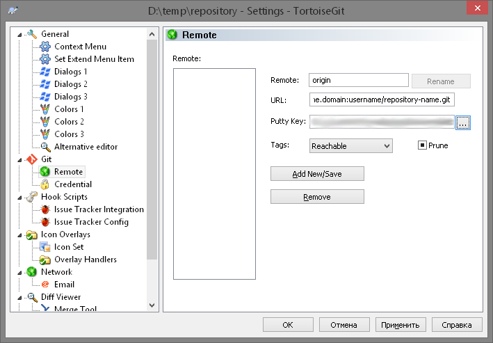

###Лабораторная работа

#Введение в системы контроля версий. Git. Работа с локальным репозиторием. Внешние сервера Git и работа с ними.

###Теоретическая часть

####Запись изменений в репозиторий(commit).

Итак, у вас имеется настоящий Git-репозиторий и рабочая копия файлов для некоторого проекта. Вам нужно делать некоторые изменения и фиксировать “снимки” состояния (snapshots) этих изменений в вашем репозитории каждый раз, когда проект достигает состояния, которое вам хотелось бы сохранить.

Как только вы отредактируете файлы, Git будет рассматривать их как изменённые, т.к. вы изменили их с момента последнего коммита. Вы индексируете (stage) эти изменения и затем фиксируете все индексированные изменения, а затем цикл повторяется.

Когда вы создаёте коммит в Git'е, Git записывает в базу объект-коммит, который содержит указатель на снимок состояния, записанный ранее в индекс, метаданные автора и комментария и ноль и более указателей на коммиты, являющиеся прямыми предками этого коммита: ноль предков для первого коммита, один — для обычного коммита и несколько — для коммита, полученного в результате слияния двух или более веток. Таким образом, Git сможет воссоздать текущее состояние, когда будет нужно.

####Что такое ветка?

Чтобы на самом деле разобраться в том, как Git работает с ветками, мы должны сделать шаг назад и рассмотреть, как Git хранит свои данные. Git хранит данные как последовательность снимков состояния.

Ветка в Git'е — это просто легковесный подвижный указатель на один из этих коммитов. Ветка по умолчанию в Git'е называется master. Когда вы создаёте коммиты на начальном этапе, вам дана ветка master, указывающая на последний сделанный коммит. При каждом новом коммите она сдвигается вперёд автоматически.

Из-за того, что ветка в Git'е на самом деле является простым файлом, который содержит 40 символов контрольной суммы SHA-1 коммита, на который он указывает, создание и удаление веток практически беззатратно. Создание новой ветки настолько же быстрое и простое, как запись 41 байта в файл (40 символов + символ новой строки).

#####Долгоживущие ветки

Так как Git использует простое трёхходовое слияние, периодически сливать одну ветку с другой на протяжении большого промежутка времени достаточно просто. Это значит, вы можете иметь несколько веток, которые всегда открыты и которые вы используете для разных стадий вашего цикла разработки; вы можете регулярно сливать их одну в другую.

Многие разработчики Git'а придерживаются такого подхода, при котором ветка master содержит исключительно стабильный код — единственный выпускаемый код. Для разработки и тестирования используется параллельная ветка, называемая develop или next, она может не быть стабильной постоянно, но в стабильные моменты её можно слить в master. Эта ветка используется для объединения завершённых задач из тематических веток, чтобы удостовериться, что эти изменения проходят все тесты и не вызывают ошибок.

#####Тематические ветки

Тематические ветки, однако, полезны в проектах любого размера. Тематическая ветка — недолговечная ветка, которую вы создаёте и используете для работы над некоторой отдельной функциональностью или для вспомогательной работы.

Такая техника позволяет быстро и полноценно переключать контекст. Ибо когда все изменения разбиты по веткам и определённым темам, намного проще понять, что было сделано, во время проверки и просмотра кода. Вы можете сохранить там изменения на несколько минут, дней или месяцев, а затем, когда они готовы, слить их в основную ветку, независимо от порядка, в котором их создавали или работали над ними.

####Работа с удалёнными репозиториями

Чтобы иметь возможность совместной работы над каким-либо Git-проектом, необходимо знать, как управлять удалёнными репозиториями. Удалённые репозитории — это модификации проекта, которые хранятся в интернете или ещё где-то в сети. Их может быть несколько, каждый из которых, как правило, доступен для вас либо только на чтение, либо на чтение и запись. Совместная работа включает в себя управление удалёнными репозиториями и помещение (push) и получение (pull) данных в и из них тогда, когда нужно обменяться результатами работы.

**git clone** — создание копии (удаленного) репозитория.
Для начала работы с центральным репозиторием, следует создать копию оригинального проекта со всей его историей локально.

Для этого в папке, где будет находиться наш репозиторий вызываем контекстное меню, и нажимаем на "Git Сlone". В поле с URL записываем путь к нашему репозиторию. Также нужно отметить поле "Load Putty key" и вставить в него путь к нашему ключу.

При нажатии Ок Git создаст копию проекта в папке с его названием.

**git fetch** и **git pull** — забираем изменения из центрального репозитория.
Для синхронизации текущей ветки с репозиторием используются команды git fetch и git pull.
**git fetch** — забрать изменения удаленной ветки из репозитория по умолчания, основной ветки; той, которая была использована при клонировании репозитория. Изменения обновят удаленную ветку (remote tracking branch), после чего надо будет провести слияние с локальной ветку командой git merge.

**git pull** - сразу забирает изменения и проводит слияние с активной веткой.

**git push** — вносим изменения в удаленный репозиторий.
После проведения работы в экспериментальной ветке, слияния с основной, необходимо обновить удаленный репозиторий (удаленную ветку). Для этого используется команда git push.

Эти комманды доступны в контекстном меню TortoiseGit.

###Практическая часть

####Добавление начальной информации в Git репозиторий.

- Создадим чистый файл README.md. Для первого коммита в репозиторий можно добавить уже существующий код.
- Теперь кликаем правой кнопкой на папке проекта, на папке ".git" в корне проекта(она обычно скрыта), или на пустом месте в папке проекта. И в контекстном меню выбираем 'Git commit -> "master"'.
- Появится окно с деталями коммита:

- Текстовое поле "Message" предназначено для краткого описания изменений, которые затрагивает этот коммит.
- Область "Changes made:" - выбор файлов которые затрагивает текущий коммит. В данном случае я добавил один файл.

Теперь у нас есть цельный репозиторий с файлами в нем.

####Изменение в Git репозитории.

Теперь вы можете измененять, добавлять или удалять какой-нибудь файл в репозиртории. Рекомендуется делать это как можно чаще, но только в том случае, если ваши изменения являются цельными, и явно не нарушают работу проекта.

####Ветвление(branching).

Во время написания чего-либо будь то книга, курсовая, проект на досуге, или работа над проектом в команде часто бывает необходимо добавить новую информацию, функционал, или переписать существующую часть при этом не нарушая целосности проекта. Для таких случаев пользуют ветвления.

- Для создания ветки в конекстном меню TortoiseGit текущего проекта есть комманда "Create branch".
- Окно создания веткивыглядит следующим образом:

- Первое поле - низвание нашей новой ветки.
- Область "Base on" говорит нам что предназначена для выбора ветки, тега или коммита(тоесть снимка, коим является ветка, коммит, или тег), на котором будет основываться наша новая ветвь.
- Опции:
    - Force - Вне зависимости от ошибок, которые могут случиться создать новую ветку.
    - Switch to new branch - Сразу после создания переключиться на новую ветку.

Итак - называем новую ветку, и жмем Ок.

Ветка создана. Для того что-бы перейти на другую ветвь необходимо выполнить комманду "Switch/Checkout" из конекстного меню TortoiseGit и в появившемся окне бырать коммит, ветку или тег на которые вы хотите перейти. Но пока мы этого делать не будем. А создадим еще один файл, и "закоммитим" изменения.

Теперь при переходе на master ветку этот файл изчезнет. Это значит что изменения в нашей новой ветке не отразились на основной. В данном контексте перспективы использования данного функуионала могут показатся излишними. Но при разработке более крупных проектов подобные возможности очень сильно помогают сохранять организованность кода. Рассмотрим пример:

Вы создаете небольшую программу. Основной функционал уже готов, и она неплохо справляется со своими "обязанностями", но через некоторое время понадобилось некоторое изменение в ее работе. Есть два варианта развития событий: вы создаете ветку и начинаете разработку нового функционала в ней, или продолжаете работать в основной ветке.
Новая вводная и этот функционал вам уже не нужен, а появилась потребность в другой "фиче"(англ. feature - особенность, черта).
Если вы вели разработку в отдельной ветке, то никаких проблем не будет, вы просто перейдете в основную ветку, отпочкуетесь опять и спокойно будете работать. Во втором-же случае нужно будет откатывать изменения в главной ветке. Естественно, вы можете предварительно отпочковать текущие изменения и проблема тоже решена, но при еще нескольких вводных решение подобных проблем будут становиться все дольше и проблематичней, что делает ветки очень удобным инструментом систем контроля версий.

Для обьединения веток существует еще один инструмент, который называется слияния.

####Слияния(merging).

- Для слияния веток в конекстном меню TortoiseGit текущего проекта есть комманда "Merge".
- Если, на пример, вы хотите чтобы изменения, которые вы зделали в ветке `issue-45` попали в `master`, нужно перейти в `master` и "сливать" из нее.
- Окно слияния ветки выглядит следующим образом:

- Первое поле предназначено для выбора указателя(ветки, коммита..) изменения которого будете "вливать" в текущую ветку.
- Также, если есть потребность, можно описать это слияние. Но в большинстве случаев автоматически генерируемоего собщения достаточно.

####Git на сервере.

К этому моменту вы уже должны уметь решать большинство повседневных задач, для которых будете использовать Git. Однако, для совместной работы в Git'е, вам необходим удалённый репозиторий. Несмотря на то, что технически вы можете отправлять и забирать изменения непосредственно из личных репозиториев, делать это не рекомендуется. Вы легко можете испортить то, над чем работают другие, если не будете аккуратны. К тому же, вам бы наверняка хотелось, чтобы остальные имели доступ к репозиторию даже если ваш компьютер выключен, поэтому наличие более надежного репозитория обычно весьма полезно. Поэтому предпочтительный метод взаимодействия с кем-либо — это создание промежуточного репозитория, к которому вы оба будете иметь доступ, и отправка и получение изменений через него.

Если вы не хотите связываться со всей работой по установке собственного Git-сервера, у вас есть несколько вариантов размещения ваших Git-проектов на внешних специальных хостинг сайтах. Это предоставляет множество преимуществ: на хостинг сайте обычно быстро настроить и запустить проект и нет никакого мониторинга или поддержки сервера. Даже если вы установили и запустили свой собственный внутренний сервер, вы можете захотеть использовать публичный хостинг сайт для вашего открытого кода — обычно сообществу открытого кода так будет проще вас найти и помочь.

В наши дни у вас есть огромное количество вариантов хостинга на выбор, все со своими преимуществами и недостатками. Актуальный список можно найти на следующей странице:

[https://git.wiki.kernel.org/index.php/GitHosting](https://git.wiki.kernel.org/index.php/GitHosting)

Поскольку мы не можем рассмотреть их все мы в этом разделе рассмотрим процесс создания учётной записи и нового проекта на GitHub'е. Если у вас есть потребность в закрытых репозиториях(бесплатно, но с ограничениями, в отличии от платного GitHub) - замечательной альтернативой GitHub является [Bitbucket](https://bitbucket.org).

GitHub — крупнейший на сегодняшний день сайт, предоставляющий Git-хостинг для проектов с открытым исходным кодом, а также один из немногих, предоставляющих одновременно и публичный, и приватный хостинг, так что вы можете хранить ваш открытый и коммерческий код в одном месте.

Первое, что вам нужно сделать, это настроить учётную запись. Регистрация ничем не отличается от регистрации на других интернет ресурсах, та что эта часть освещаться не будет.

Главное что вам нужно сделать, для того, что-бы нормально работать с репозиторием - это добавить ваш ключ в список раврешенных ключей. Для этого в настройках профиля, в разделе "SSH Keys" нажмите на кнопку "Add SSH key". В появившейся форме будет всего два поля. Название вашему ключу можете дать абсолютно любое, так как оно влияет только на узнавание вами определеного ключа. Что нас действительно интересует - это поле Key.

В предыдущей лабораторной работе с помошью утилиты PuTTYgen мы создавали RSA ключ. С помошью этой-же утитилы теперь откроем его.

Теперь скопируйте все символы из поля "Public key for passing into OpenSSH...", и вставьте его в Поле "Key" нашей формы. И сохраните ключ нажавкнопку "Add key".

Все, для авторизации на вервере вы будете использовать этот файл ключа, так что не потеряйте его.

Вернемся к нашему проекту.

Для того, чтобы перенести проект на сервер в системе github нужно создать репозиторий. Делается это предельно просто:

- На главной, или на верхнем меню возле имени аккаунта(плюсик -> в выпадающем меню) есть кнопка "New repository", которая ведет на простую и понятную форму создания репозитория. Нужно заполнить поля с имеменем, и описанием(не обязательно) и нажать "Create repository".
- Далее перейдите в раздел репозитория и справа будет небольшое поле "SSH clone URL" из которого нужно скопировать ссылку на этот репозиторий. Ссылка выглядит следующим образом: git@sitename.domain:username/repository-name.git где:
    - *git* - указывает что это гит репозиторий, и использовать нужно определенный протокол.
    - *sitename.domain* - имя сайта, в нашем случае это github.com
    - *username* - имя пользователя(ваш ник)
    -  *repository-name.git* - название вашего репозитория с расширением
- Теперь в вашем проекте нужно открыть настройки: контекстное меню TortoiseGit -> Settings и в разделе Git -> Remote в поле "URL" вставить ссылку на репозиторий, а в поле PuttyKey прописать путь к вашему файлу ключей.

- Нажмите на кнопку "Add New/Save" и все - теперь ваш проект подключен к удаленному репозиторию.

####Рабора с удаленным репозиторием.

Так как мы уже настроили наш локальный репозиторий на работу с удаленным, о теперь мы можем приступить к работе с ним.

- Перейдем на `master` ветку  с помошью комманды "Switch/Checkout".
- Выполним комманду "Git Pull" из контекстного меню TortoiseGit - это нужно, что-бы получить текущие изменения в ветке(в данном случае их не должно быть).
- Выполним комманду "Git Push" из контекстного меню TortoiseGit.
- Появится окно с уточнениями относительно выполняемой комманды:
    -  "Ref": Откуда будут производится изменения
        - "Push all branches" - внести изменения всех доступных локально веток в удаленный репозиторий.
        - "Local" - ветка, из которой которую будут вноситься изменения удаленно.
        - "Remote" - удаленный сервер, с которого будут отправляться изменения.
    - "Destination":
        - "Remote" - удаленный сервер, на котором будут применяться изменения.
- Нажимаем Ок. И проверяем наш репозиторий на сайте github.com.

####На этом все. Всем всего. Проверьте себя ответив на контрольные вопросы ниже&darr; и если все в порядке - бегом делать следующую лабку.

###Контрольные вопросы

1. Что такое коммит?
2. Что такое ветки?
3. Какой смысл в создании и работе с тематическими ветками?
4. Слияния, решение конфликтов при слияниях(самостоятельная письменная работа а-ля реферат).
5. Пример проекта на одном из бесплатных удаленных ресурсов(Ссылка) с описанием этого самого проекта.